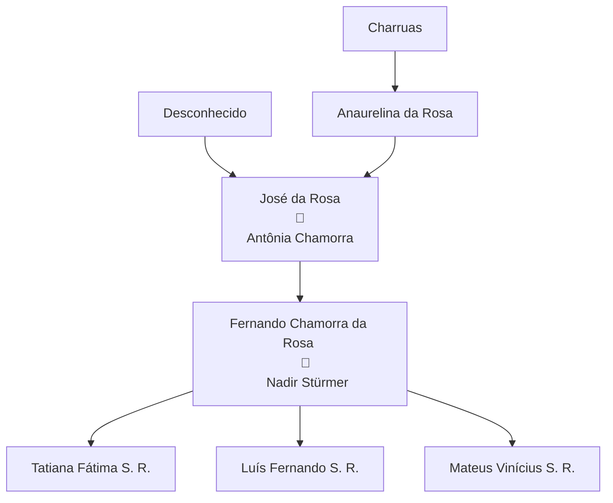
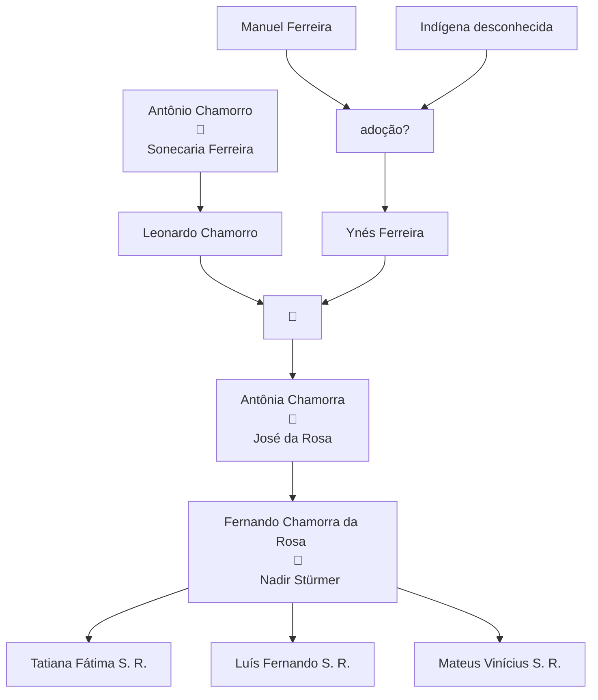

# 🌳 Genealogia da família 'da Rosa'.

Este documento foi escrito por Luis Fernnado Stürmer da Rosa, e trata-se de uma pesquisa sobre a origem da família da Rosa. É uma obra que reúne informações coletadas dentro da família acerca de histórias da nossa família e também algumas reflexões científicas e históricas acerca da nossa origem.

O documento que você está lendo agora está sendo desenvolvido aos poucos e em horários de folga, i.e, não é uma obra acabada.  Deste modo, se você teve acesso à obra com esta introdução, na situação em que ele se encontra, isto indica que você tem uma versão ainda não acabada. Caso tenha interesse em obter a versão acabada entre em contato comigo, adicionando-me no meu Instagram: @luisfernando.sr

Este documento, como está sendo feito por mim, é bastante personalizado para para mim. No entanto, sinta-se a vontade de alterá-lo e personalizá-lo para você e depois compartilhe a sua versão comigo.

Vamos trocar informações e enriquecer ainda mais a geanalogia da nossa família!

## Origem Charrua:

**Histórias ancestrais**:

<u>Fernando</u>:  ★

<u>José</u>: ★†

<u>Anaurelina</u>: ★ Segundo Fernando, Anaurelina teria contado a José que era Charrua. Ela falava o idioma original, porém não ensinou a José. †

<u>Charruas</u>:

## Origem espanhola e de outra etnia indígena:

**<u>Histórias ancestrais</u>**:

Antônia: ★†

Leonardo: ★ 16/03/1889 em Yacaré, Artigas, 'Jornalero' †

**Data da celebração:** 15 de junho de 1918 do casamento de Leonardo e Ynés, no Departamento de Artigas, Seção Yacaré.

Ynés: ★ 21/01/1893 em Yacaré, Artigas, afazeres domésticos (*ocupaciones de su sexo*) †

Antônio: ★† Pai de Leonardo.

Sonecaria: ★† Mãe de Leonardo.

Manuel: ★† Pai de Ynés.

Indígena desconhecida: ★† mãe de Ynés desconhecida (*desconocida*).

## Análise genética:

O uso de ferramentas de inteligência artificial hoje está bastante disseminada e não poderia ser diferente comigo. Resolvi utilizar esta ferramenta principalmente para suprir alguma falta de informação genética acerca da nossa família.

Felizmente, há alguns anos, fiz um exame de DNA que demonstrou com precisão a minha constituição genética. De posse disso, solicitei que a IA fizesse uma análise fenotípica da minha foto e me surpreendi com a precisão da análise da IA. Assim, resolvi usá-la para enriquecer este trabalho.

Clique nesse link para ver com detalhe como usei a IA [clique aqui](https://share.gemini.google/sJEDV5KtysCf).

De modo resumido, forneci algumas fotos minhas e usei o seguinte prompt: "Pelas características fenotípicas, monte um percentil étnico do indivíduo nas fotos", obtendo a seguinte resposta:

---

### Estimativa de Composição Fenotípica (Aproximada)

| **Origem Regional / Étnica**                                     | **Estimativa Aproximada** | **Traços Associados Observados**                                                                       |
| ---------------------------------------------------------------- | ------------------------- | ------------------------------------------------------------------------------------------------------ |
| **Europeia (SUL / CENTRAL)**                                     | **60% – 70%**             | Tom de pele claro, densidade e padrão de crescimento da barba, projeção do osso nasal e perfil facial. |
| **Leste Asiático / Indígena**                                    | **20% – 30%**             | Formato e abertura dos olhos, estrutura das maçãs do rosto (zigomático) e textura lisa do cabelo.      |
| **Outras Ancestralidades (ex: Médio Oriente / Norte da África)** | **5% – 10%**              | Pigmentação dos cabelos/olhos e traços do perfil nasal e pilosidade facial.                            |

> **Nota:** Esta distribuição reflete apenas a percepção dos traços fenotípicos superficiais. Para um percentual étnico real e preciso, é necessário realizar um teste genético de DNA (como de ancestralidade por SNP).

Fim da resposta da IA.

---

Os percentuais apresentados pela inteligência articial se aproximaram bastante com meu perfil genético, que foi feito a partir de meu material genético. Eu o forneci para a empresa genera, que me retornou a seguinte composição genética:

### Perfil Genético do Indivíduo

| Região Continental          | Região / Etnia                                                         | Porcentagem |
|:--------------------------- |:---------------------------------------------------------------------- |:----------- |
| **Europa**                  | **Total da Europa**                                                    | **81%**     |
|                             | Europa Ocidental (Alemanha, França e Países Baixos) e Ilhas Britânicas | 55%         |
|                             | Ibéria                                                                 | 9%          |
|                             | Cáucaso                                                                | 4%          |
|                             | Sardenha                                                               | 4%          |
|                             | Judeus Ashkenazim                                                      | 3%          |
|                             | Leste Europeu                                                          | < 3%        |
|                             | Fenoscândia                                                            | < 3%        |
|                             | Itália                                                                 | < 2%        |
|                             | Lapônia e Volga-Ural                                                   | < 2%        |
| **Américas**                | **Total das Américas**                                                 | **17%**     |
|                             | Amazônia                                                               | 11%         |
|                             | América Andina                                                         | 4%          |
|                             | América Central                                                        | < 2%        |
|                             | Tupi                                                                   | < 2%        |
| **Oriente Médio e Magrebe** | **Total da Região**                                                    | **< 2%**    |
|                             | Levante                                                                | < 2%        |
| **Ásia**                    | **Total da Ásia**                                                      | **< 2%**    |
|                             | Sul da Ásia                                                            | < 2%        |

Observe que a inteligência articial, o retornar aquele primeiro quadro fenotípico, ficou na dúvida com a minha ancestralidade entre a ameríndia e a asiática. E isso coincide com o que se teoriza sobre imigrações populacionais e a origem dos primeiros influxos humanos na América. Entende-se que a maioria dos indígenas teriam atravessado o estreito de Bering (entre a Rússia e o Alasca) e populado a América. Há também vestígios genéticos, de herança genética, da Oceania, indicando possível imigração da Oceania e Polinésia ao continente Sul Americano:

A semelhança entre ameríndios e asiáticos é notável:

Veja a explicação da IA:

---

### Traços Fenotípicos Indígenas e a Relação com o Leste Asiático

As características faciais e físicas observadas em populações nativas americanas e do Leste Asiático compartilham diversos marcadores biológicos comuns:

1. **Prega Epicântica e Formato dos Olhos**:
   
   - **O que é**: Uma dobra de pele no canto interno do olho (no canco medial) que cobre a carúncula lacrimal, dando aos olhos um formato mais amendoado ou levemente puxado.
   
   - **Por que ocorre**: Desenvolveu-se historicamente como uma adaptação evolutiva ao frio extremo, vento e claridade intensa do gelo/neve na Sibéria e na Ásia Central, protegendo o globo ocular e reduzindo o brilho. Essa característica foi herdada pelos povos que povoaram o continente americano.

2. **Projeção dos Ossos Zigomáticos (Maçãs do Rosto)**:
   
   - **O que é**: As maçãs do rosto tendem a ser mais altas, largas e proeminentes, conferindo uma estrutura facial mais plana no plano frontal.
   
   - **Por que ocorre**: Essa estrutura óssea reduz a exposição da face ao congelamento em climas extremamente frios e oferece maior sustentação à musculatura mastigatória. É um traço marcante tanto em asiáticos orientais quanto em populações indígenas das Américas.

3. **Textura do Cabelo (Cabelo Lisótrico)**:
   
   - **O que é**: Cabelos pretos, espessos, de corte transversal redondo e extremamente lisos.
   
   - **Por que ocorre**: O gene *EDAR* (especificamente a variante *EDAR V370A*), muito comum na Ásia Oriental e nas populações nativas americanas, está diretamente associado à espessura do fio de cabelo, ao padrão liso, a dentes incisivos em formato de pá (*shovel-shaped incisors*) e a alterações nas glândulas sudoríparas.

4. **Pigmentação e Pilosidade Corporal**:
   
   - **Pele**: Tons que variam do amarelado/oliva ao castanho-médio, com boa tolerância ao sol.
   
   - **Pilosidade**: Menor densidade de pelos corporais e faciais (barbas menos densas ou ausentes em comparação a populações europeias ou do Oriente Médio).

Fim da resposta da IA.

---

Prosseguindo na minha pesquisa, dei o seguinte prompt à IA: "Faça uma imagem explicativa das características ameríndias e compare ao rosto do indivíduo analisado". Ela me retornou a seguinte imagem:

Seguindo na brincadeira, resolvi fornecer uma foto do meu pai e solicitei que a inteligência artificial fizesse comparações semelhantes com o que fizera em relação ao meu fenotipo.

Eis sua resposta:

---

### Estimativa de Composição Fenotípica (Aproximada)

| **Origem Regional / Étnica**                                 | **Estimativa Aproximada** | **Traços Associados Observados**                                                                   |
| ------------------------------------------------------------ | ------------------------- | -------------------------------------------------------------------------------------------------- |
| **Europeia (SUL / OCIDENTAL)**                               | **55% – 65%**             | Tom de pele claro, estrutura geral da ponte nasal e do formato craniofacial.                       |
| **Indígena / Ameríndia (Américas)**                          | **25% – 35%**             | Formato e abertura dos olhos, projeção dos ossos zigomáticos (maçãs do rosto) e textura do cabelo. |
| **Outras Ancestralidades (ex: Médio Oriente / Sul da Ásia)** | **5% – 10%**              | Nuances no contorno dos olhos, tom de pele e pigmentação capilar.                                  |

Fim da resposta da IA

---

A inteligência artificial analisou que, em comparação comigo, a influência indígena no pai é mais visível.

Por fim, forneci essa foto do vô José:

Forneci o seguinte prompt "Agora analise esse indivíduo. Retorne os percentis étnicos" e obtive o seguinte quadro:

### Estimativa de Composição Fenotípica (Aproximada)

| **Origem Regional / Étnica**                                | **Estimativa Aproximada** | **Traços Associados Observados**                                                                             |
| ----------------------------------------------------------- | ------------------------- | ------------------------------------------------------------------------------------------------------------ |
| **Indígena / Ameríndia (Américas)**                         | **60% – 70%**             | Projeção zigomática acentuada, formato dos olhos, prega epicântica, cabelo lisótrico e padrão de pilosidade. |
| **Europeia (Ibéria / Sul de Europa)**                       | **25% – 35%**             | Estrutura geral do contorno facial, formato da ponte nasal e fototipo de pele.                               |
| **Outras Ancestralidades (ex: Subsariana / Médio Oriente)** | **5% – 10%**              | Nuances na largura da base nasal e textura dos lábios.                                                       |

Fim da resposta da IA.

---

Até o presente momento não disponho de fotos do restante da família, principalmente da minha bisavó Anaurelina. E ainda falta fazer uma análise sobre a parte da avó Antônia e bisavó Ynés.

Aliás, eu percebi que disponho de poucas fotos da família, e se alguém tiver condições de compartilhar mais comigo, por favor, o faça!

https://maps.app.goo.gl/pXyAsNkFReAgjjy38?g_st=ac

https://maps.app.goo.gl/cDBZj1Zjht12i6HV8?g_st=ac
