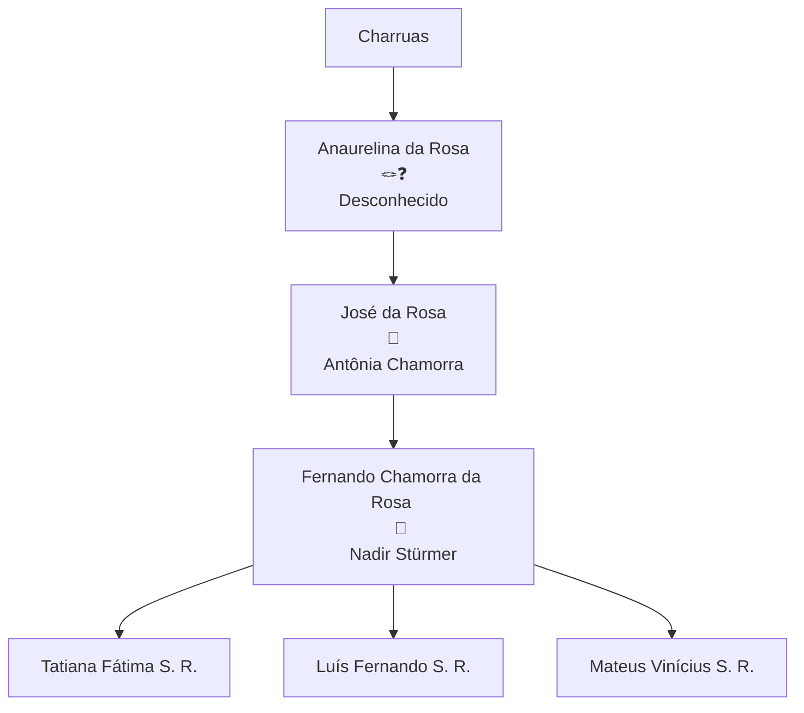
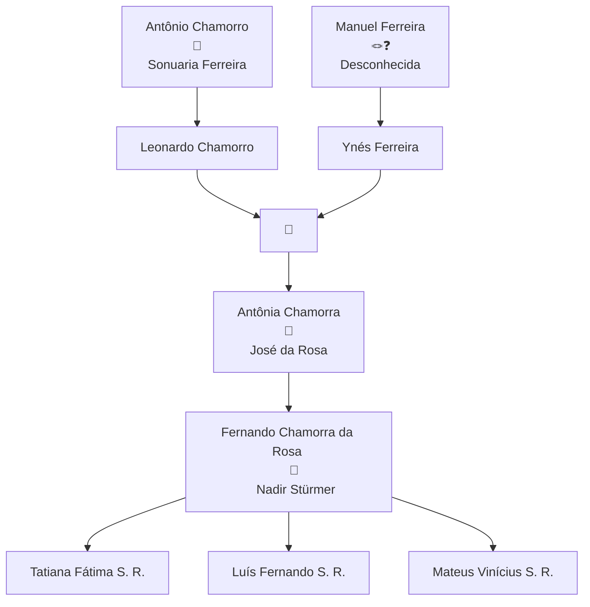

# 🌳 Genealogia da família 'da Rosa'.

Este documento está sendo escrito por Luis Fernando Stürmer da Rosa, e trata-se de uma pesquisa sobre a origem da família da Rosa. É uma obra que reúne informações coletadas dentro da família acerca de histórias da nossa família e também algumas reflexões científicas e históricas acerca da nossa origem.

O documento que você está lendo agora está sendo desenvolvido aos poucos e em horários de folga, i.e, não é uma obra acabada. Caso tenha interesse em contribuir com documentos, histórias, informações e correções, entre em contato comigo adicionando-me no Instagram: @luisfernando.sr

Por questão de vida prática e definição de escopo, decidi enfocar mais na linha reta de ancestralidade, porém há informação suficiente aqui para ser de interesse a todos os membros da família.

Sinta-se a vontade de alterar e personalizar este documento para o seu ramo da família e depois compartilhar a sua versão comigo (posso colocar um link aqui se for disponibilizado na internet).

Vamos trocar informações e enriquecer ainda mais a geanalogia da nossa família!

Toda contribuição será reconhecida expressamente.

Agradecimentos:

- Tia Anaurelina: por disponibilizar fotos do RG do vô José e do Matrimônio do dos Bisavôs Leonardo e Ynés.

- Pai Fernando: Por contar histórias da família.

```
SÍMBOLOS:
★ = Nascimento
† = Falecimento
💍 = Casamento
🪢❓= Vínculo desconhecido
```

## Origem Charrua:

Árvore genealógica parcial:



### Ancestrais identificados:

#### 👤 Anaurelina da Rosa

★

†

- **Grau de Parentesco:** Bisavó de Luís

- **Linhagem / Ramo / Declaração Cultural:** da Rosa / Origem Charrua

- **Idioma(s) Falado(s):** Idioma Charrua (não transmitido às gerações seguintes) e Português

- **Pai:** Ainda não identificado

- **Mãe:** Ainda não identificada

- **Filhos:** José da Rosa e outros ainda não identificados

> **Tradição Oral:** Segundo relato de Fernando Chamorra da Rosa, Anaurelina contou a seu filho José que era de etnia Charrua. Ela falava fluentemente a língua original nativa, mas optou por não ensinar o idioma a José (padrão histórico de proteção contra a discriminação).

- [x] Documento de identificação: Menção no RG de José da Rosa.

- [ ] Fotografia: Pendente

#### 👤 José da Rosa


★ Em Uruguaiana/RS, 23/11/1930.

† Em Uruguaiana/RS, na data de ...

- **Grau de Parentesco:** Avô de Luís / Pai de Fernando

- **Linhagem / Ramo / Declaração Cultural:** da Rosa / Origem Charrua

- **Idioma(s) Falado(s):** Idioma Português

- **Pai:** Desconhecido

- **Mãe:** Anaurelina da Rosa

- **Filhos:** ...

> **Tradição Oral:** Conta-se que...

- [x] Documento de identificação: Coletado (RG)

#### 👤Fernando Chamorra da Rosa

 ★ Uruguaiana/RS, em 19/12/1955.

- **Grau de Parentesco:** Pai de Luís

- **Linhagem / Ramo / Declaração Cultural:** da Rosa / Origem Charrua

- **Idioma(s) Falado(s):** Português

- **Pai:** José da Rosa

- **Mãe:** Antônia Chamorra da Rosa

- **Filhos:** Tatiana Fátima Stürmer da Rosa, Luís Fernando Stürmer da Rosa e Mateus Vinícius Stürmer da Rosa.

> **Tradição Oral:** ...

- [x] Documento de identificação: Coletado (RG)

## Origem espanhola e de outra etnia indígena:



### Ancestrais identificados:

#### 👤Antônio Chamorro

★ Provavelmente Yacaré, Artigas, UY

† Provavelmente Yacaré, Artigas, UY

- **Grau de Parentesco:** Trisavô de Luís

- **Linhagem / Ramo / Declaração Cultural:** Ibérico (espanhol)

- **Idioma(s) Falado(s):** Idioma Espanhol

- **Pai:** Sem informação

- **Mãe:** Sem informação

- **Filhos:** Leonardo Chamorro e talvez outros

> **Tradição Oral:** Conta-se que...

- [x] Documento de identificação: Menção na certidão de casamento de Leonardo e Ynés.

#### 👤 Sonuaria Ferreira

★ Provavelmente Yacaré, Artigas, UY

† Provavelmente Yacaré, Artigas, UY

- **Grau de Parentesco:** Trisavó de Luís

- **Linhagem / Ramo / Declaração Cultural:** Ibérico

- **Idioma(s) Falado(s):** Idioma Espanhol

- **Pai:** Sem informação

- **Mãe:** Sem informação

- **Filhos:** Leonardo Chamorro e talvez outros

> **Tradição Oral:** Conta-se que...

- [x] Documento de identificação: Menção na certidão de casamento de Leonardo e Ynés.

#### 👤Manuel Ferreira

★ Provavelmente Yacaré, Artigas, UY

† Provavelmente Yacaré, Artigas, UY

- **Grau de Parentesco:** Trisavô de Luís

- **Linhagem / Ramo / Declaração Cultural:** Ibérico

- **Idioma(s) Falado(s):** Idioma Espanhol

- **Pai:** Sem informação

- **Mãe:** Sem informação

- **Filhos:** Ynés Ferreira e talvez outros

> **Tradição Oral:** Conta-se que...

- [x] Documento de identificação: Menção na certidão de casamento de Leonardo e Ynés.

#### 👤Desconhecida

* **Filhos:** Ynés Ferreira e talvez outros
- [x] Documento de identificação: Menção na certidão de casamento de Leonardo e Ynés.

O documento em questão é esse, que segue pubicado, pois já muito antigo:


#### 👤Leonardo Chamorro

★ 16/05/1889, Yacaré, Artigas, UY

† Provavelmente Yacaré, Artigas, UY

- **Grau de Parentesco:** Bisavô de Luís

- **Linhagem / Ramo / Declaração Cultural:** Ibérico (espanhol)

- **Idioma(s) Falado(s):** Idioma Espanhol e Português

- **Pai:** Antônio Chamorro

- **Mãe:** Sonuaria Ferreira

- **Filhos:** Antônia Chamorra e talvez outros

> **Tradição Oral:** Conta-se que...

- [x] Documento de identificação: Certidão de casamento.

#### 👤Ynés Ferreira

★ 21/01/1893, Yacaré, Artigas, UY

† Provavelmente Yacaré, Artigas, UY

- **Grau de Parentesco:** Bisavó de Luís

- **Linhagem / Ramo / Declaração Cultural:** Ibérico (espanhol)

- **Idioma(s) Falado(s):** Idioma Espanhol e Português

- **Pai:** Manuel Ferreira

- **Mãe:** Desconhecida

- **Filhos:** Antônia Chamorra e talvez outros

> **Tradição Oral:** Conta-se que...

- [x] Documento de identificação: Certidão de casamento.

#### 👤Antônia Chamorra


★ Uruguaiana, BR

† Uruguaiana, BR

- **Grau de Parentesco:** Avó de Luís

- **Linhagem / Ramo / Declaração Cultural:** Ibérico

- **Idioma(s) Falado(s):** Idioma Português

- **Pai:** Leonardo Chamorro

- **Mãe:** Ynés Ferreira

- **Filhos:** Fernando...

> **Tradição Oral:** Conta-se que...

- [ ] Documento de identificação: Pendente.

## Análise genética:

O uso de ferramentas de inteligência artificial hoje está bastante disseminada e não poderia ser diferente comigo. Resolvi utilizar esta ferramenta principalmente para suprir alguma falta de informação genética acerca da nossa família.

Felizmente, há alguns anos, fiz um exame de DNA que demonstrou com precisão a minha constituição genética. De posse disso, solicitei que a IA fizesse uma análise fenotípica da minha foto e me surpreendi com a precisão da análise da IA. Assim, resolvi usá-la para enriquecer este trabalho.

Clique nesse link para ver com detalhe como usei a IA [clique aqui](https://share.gemini.google/sJEDV5KtysCf).

De modo resumido, forneci algumas fotos minhas e usei o seguinte prompt: "Pelas características fenotípicas, monte um percentil étnico do indivíduo nas fotos", obtendo a seguinte resposta:

---

### Estimativa de Composição Fenotípica (Aproximada)

| **Origem Regional / Étnica**                                     | **Estimativa Aproximada** | **Traços Associados Observados**                                                                       |
| ---------------------------------------------------------------- | ------------------------- | ------------------------------------------------------------------------------------------------------ |
| **Europeia (SUL / CENTRAL)**                                     | **60% – 70%**             | Tom de pele claro, densidade e padrão de crescimento da barba, projeção do osso nasal e perfil facial. |
| **Leste Asiático / Indígena**                                    | **20% – 30%**             | Formato e abertura dos olhos, estrutura das maçãs do rosto (zigomático) e textura lisa do cabelo.      |
| **Outras Ancestralidades (ex: Médio Oriente / Norte da África)** | **5% – 10%**              | Pigmentação dos cabelos/olhos e traços do perfil nasal e pilosidade facial.                            |

> **Nota:** Esta distribuição reflete apenas a percepção dos traços fenotípicos superficiais. Para um percentual étnico real e preciso, é necessário realizar um teste genético de DNA (como de ancestralidade por SNP).

Fim da resposta da IA.

---

Os percentuais apresentados pela inteligência articial se aproximaram bastante com meu perfil genético, que foi feito a partir de meu material genético. Eu o forneci para a empresa genera, que me retornou a seguinte composição genética:

### Perfil Genético do Indivíduo

| Região Continental          | Região / Etnia                                                         | Porcentagem |
|:--------------------------- |:---------------------------------------------------------------------- |:----------- |
| **Europa**                  | **Total da Europa**                                                    | **81%**     |
|                             | Europa Ocidental (Alemanha, França e Países Baixos) e Ilhas Britânicas | 55%         |
|                             | Ibéria                                                                 | 9%          |
|                             | Cáucaso                                                                | 4%          |
|                             | Sardenha                                                               | 4%          |
|                             | Judeus Ashkenazim                                                      | 3%          |
|                             | Leste Europeu                                                          | < 3%        |
|                             | Fenoscândia                                                            | < 3%        |
|                             | Itália                                                                 | < 2%        |
|                             | Lapônia e Volga-Ural                                                   | < 2%        |
| **Américas**                | **Total das Américas**                                                 | **17%**     |
|                             | Amazônia                                                               | 11%         |
|                             | América Andina                                                         | 4%          |
|                             | América Central                                                        | < 2%        |
|                             | Tupi                                                                   | < 2%        |
| **Oriente Médio e Magrebe** | **Total da Região**                                                    | **< 2%**    |
|                             | Levante                                                                | < 2%        |
| **Ásia**                    | **Total da Ásia**                                                      | **< 2%**    |
|                             | Sul da Ásia                                                            | < 2%        |

Observe que a inteligência articial, o retornar aquele primeiro quadro fenotípico, ficou na dúvida com a minha ancestralidade entre a ameríndia e a asiática. E isso coincide com o que se teoriza sobre imigrações populacionais e a origem dos primeiros influxos humanos na América. Entende-se que a maioria dos indígenas teriam atravessado o estreito de Bering (entre a Rússia e o Alasca) e populado a América. Há também vestígios genéticos, de herança genética, da Oceania, indicando possível imigração da Oceania e Polinésia ao continente Sul Americano:


A semelhança entre ameríndios e asiáticos é notável:


Veja a explicação da IA:

---

### Traços Fenotípicos Indígenas e a Relação com o Leste Asiático

As características faciais e físicas observadas em populações nativas americanas e do Leste Asiático compartilham diversos marcadores biológicos comuns:

1. **Prega Epicântica e Formato dos Olhos**:
   
   - **O que é**: Uma dobra de pele no canto interno do olho (no canco medial) que cobre a carúncula lacrimal, dando aos olhos um formato mais amendoado ou levemente puxado.
   
   - **Por que ocorre**: Desenvolveu-se historicamente como uma adaptação evolutiva ao frio extremo, vento e claridade intensa do gelo/neve na Sibéria e na Ásia Central, protegendo o globo ocular e reduzindo o brilho. Essa característica foi herdada pelos povos que povoaram o continente americano.

2. **Projeção dos Ossos Zigomáticos (Maçãs do Rosto)**:
   
   - **O que é**: As maçãs do rosto tendem a ser mais altas, largas e proeminentes, conferindo uma estrutura facial mais plana no plano frontal.
   
   - **Por que ocorre**: Essa estrutura óssea reduz a exposição da face ao congelamento em climas extremamente frios e oferece maior sustentação à musculatura mastigatória. É um traço marcante tanto em asiáticos orientais quanto em populações indígenas das Américas.

3. **Textura do Cabelo (Cabelo Lisótrico)**:
   
   - **O que é**: Cabelos pretos, espessos, de corte transversal redondo e extremamente lisos.
   
   - **Por que ocorre**: O gene *EDAR* (especificamente a variante *EDAR V370A*), muito comum na Ásia Oriental e nas populações nativas americanas, está diretamente associado à espessura do fio de cabelo, ao padrão liso, a dentes incisivos em formato de pá (*shovel-shaped incisors*) e a alterações nas glândulas sudoríparas.

4. **Pigmentação e Pilosidade Corporal**:
   
   - **Pele**: Tons que variam do amarelado/oliva ao castanho-médio, com boa tolerância ao sol.
   
   - **Pilosidade**: Menor densidade de pelos corporais e faciais (barbas menos densas ou ausentes em comparação a populações europeias ou do Oriente Médio).

Fim da resposta da IA.

---

Prosseguindo na minha pesquisa, dei o seguinte prompt à IA: "Faça uma imagem explicativa das características ameríndias e compare ao rosto do indivíduo analisado". Ela me retornou a seguinte imagem:


Seguindo na brincadeira, resolvi fornecer uma foto do meu pai e solicitei que a inteligência artificial fizesse comparações semelhantes com o que fizera em relação ao meu fenotipo.

Eis sua resposta:

---

### Estimativa de Composição Fenotípica (Aproximada)

| **Origem Regional / Étnica**                                 | **Estimativa Aproximada** | **Traços Associados Observados**                                                                   |
| ------------------------------------------------------------ | ------------------------- | -------------------------------------------------------------------------------------------------- |
| **Europeia (SUL / OCIDENTAL)**                               | **55% – 65%**             | Tom de pele claro, estrutura geral da ponte nasal e do formato craniofacial.                       |
| **Indígena / Ameríndia (Américas)**                          | **25% – 35%**             | Formato e abertura dos olhos, projeção dos ossos zigomáticos (maçãs do rosto) e textura do cabelo. |
| **Outras Ancestralidades (ex: Médio Oriente / Sul da Ásia)** | **5% – 10%**              | Nuances no contorno dos olhos, tom de pele e pigmentação capilar.                                  |

Fim da resposta da IA

---

A inteligência artificial analisou que, em comparação comigo, a influência indígena no pai é mais visível.

Por fim, forneci uma foto do vô José e forneci o seguinte prompt "Agora analise esse indivíduo. Retorne os percentis étnicos" e obtive o seguinte quadro:

### Estimativa de Composição Fenotípica (Aproximada)

| **Origem Regional / Étnica**                                | **Estimativa Aproximada** | **Traços Associados Observados**                                                                             |
| ----------------------------------------------------------- | ------------------------- | ------------------------------------------------------------------------------------------------------------ |
| **Indígena / Ameríndia (Américas)**                         | **60% – 70%**             | Projeção zigomática acentuada, formato dos olhos, prega epicântica, cabelo lisótrico e padrão de pilosidade. |
| **Europeia (Ibéria / Sul de Europa)**                       | **25% – 35%**             | Estrutura geral do contorno facial, formato da ponte nasal e fototipo de pele.                               |
| **Outras Ancestralidades (ex: Subsariana / Médio Oriente)** | **5% – 10%**              | Nuances na largura da base nasal e textura dos lábios.                                                       |


Fim da resposta da IA.

---

Até o presente momento não disponho de fotos do restante da família, principalmente da minha bisavó Anaurelina. E ainda falta fazer uma análise sobre a parte da avó Antônia e bisavó Ynés.

Aliás, eu percebi que disponho de poucas fotos da família, e se alguém tiver condições de compartilhar mais comigo, por favor, o faça!

# Quem são os Charruas?

Sim, a pergunta está no tempo verbal correto. Os Charruas não foram extintos como ensinam. Muita da história ameríndia que é ensinada são invenções, mentiras e desculpas para ocultar a história e fazer vistas grossas ao genocídio praticado neste continente.

Com a etnia da qual proviemos a história conta que seu fim se deu no Massacre de Salsipuedes.

Mas aquele não foi o fim da história Charrua. Os Charruas vivem! Só que eles não são os mesmos, eles se adaptaram para sobreviver.

## Quem foram?

É também verdade que aqueles Charruas de antigamente tinham um modo de vida bem diferente dos de hoje.

## Como tentaram acabar com a etnia?

Apunhalados pelas costas por Fructuoso Rivera...

## Como sobreviveram?

Nem todos estavam em Salsipuedes...

## Quem são?

Aldeia Polidoro, POA/RS...

https://brasil.elpais.com/brasil/2017/10/13/internacional/1507902270_613238.html

https://maps.app.goo.gl/pXyAsNkFReAgjjy38?g_st=ac

https://maps.app.goo.gl/cDBZj1Zjht12i6HV8?g_st=ac

# Status deste trabalho:

Abaixo está o checklist estruturado para a complementação e finalização do documento de genealogia da família da Rosa. Os itens foram divididos por seções temáticas, priorizando pendências de documentação cartorial, coleta de relatos, checagem genético-científica e organização editorial.

**Seção / Categoria****Tarefas e Informações a Coletar****Prioridade****Status**

1. Ramos Familiares & Genealogia Documental **Alta**Pendente
- **Documentação do Vô José & Bisavó Anaurelina:** Localizar certidão de nascimento/batismo e óbito de José da Rosa e Anaurelina da Rosa para confirmar filiação e local de origem.
- **Registros em Yacaré / Artigas (Uruguai):** Pesquisar registros civis ou paroquiais adicionais de Leonardo Chamorro, Ynés Ferreira, Antônio Chamorro e Sonecaria Ferreira.
- **Origem de Manuel Ferreira e Indígena Desconhecida:** Investigar arquivos históricos de Artigas/Salto para identificar a filiação ou processo de adoção/criação de Ynés Ferreira.
- **Ramo Stürmer (Materno):** Incluir a árvore genealógica do ramo Stürmer (Nadir Stürmer e antepassados alemães/europeus) para justificar os 55% de Europa Ocidental do teste de DNA.
2. Registros Fotográficos & Acervo Visual**Alta**Pendente
- **Fotos Faltantes (Linha Direta):** Resgatar fotos da Bisavó Anaurelina, Avó Antônia Chamorra e Bisavó Ynés Ferreira com parentes e conhecidos.
- **Digitalização em Alta Resolução:** Substituir links externos temporários (OneDrive) por imagens salvas diretamente na estrutura final da obra.
- **Legendas e Cronologia:** Catalogar o ano aproximado e local de cada foto familiar obtida.
3. Histórias Ancestrais & Tradição Oral**Média**Pendente
- **História de Anaurelina:** Entrevistar Fernando Chamorra da Rosa para registrar mais detalhes sobre o que Anaurelina contava (palavras no idioma Charrua, costumes, memórias).
- **História de José e Antônia:** Redigir os verbetes biográficos de José da Rosa e Antônia Chamorra nas seções marcadas com o símbolo (★†).
- **Entrevistas Sistematizadas:** Gravar áudios ou anotações com parentes mais velhos para preservar causalidades e anedotas da vida em Artigas e no Rio Grande do Sul.
4. Ajustes Científicos & Genética***Média**Em Andamento
- **Diferenciação Crítica (DNA x Fenótipo por IA):** Adicionar nota metodológica explicando que a IA analisa apenas traços visuais da foto (sujeita a iluminação e ângulo) e que o teste de DNA de SNP (Genera) é o padrão científico real.
- **Análise Genética do Pai / Outros Familiares:** Avaliar a realização do teste de DNA autosomal no pai (Fernando) para mapeamento direto do DNA ameríndio sem diluição geracional.
- **Correlação Haplogrupos (Paterno/Materno):** Verificar no painel da Genera os haplogrupos Y-DNA (linhagem paterna) e mtDNA (linhagem materna) para confirmar as rotas migratórias ancestrais.
5. Capítulo Histórico: Os Charruas**Média**Pendente
- **Seção "Quem foram?":** Escrever a introdução sobre o território histórico Charrua (Pampa, Uruguai, Rio Grande do Sul e Entre Ríos).
- **Seção "Como tentaram acabar com a etnia?":** Contextualizar o Massacre de Salsipuedes (1831) promovido por Fructuoso Rivera.
- **Seção "Como sobreviveveram? & Quem são?":** Abordar o reagrupamento familiar, a miscigenação forçada/estratégica, a invisibilização estatística e o movimento de reemergência étnica atual (ex: CODECHA no Uruguai).
- **Mapeamento Geográfico:** Substituir ou identificar explicitamente o destino dos dois links do Google Maps inseridos no final do texto.
6. Diagramação & Edição Geral**Baixa**Pendente
- **Padronização de Símbolos:** Definir uma legenda clara no início da obra para a notação utilizada (ex: ★ = Nascimento, † = Falecimento, 💍 = Casamento).
- **Correção Gramatical e Ortográfica:** Revisar digitações do rascunho (ex: "geanalogia", "articial", "canco medial").
- **Formatação de Diagramas Mermaid:** Padronizar os nomes nos nós dos gráficos (ex: letras maiúsculas/minúsculas de identificação) para correta renderização visual.
